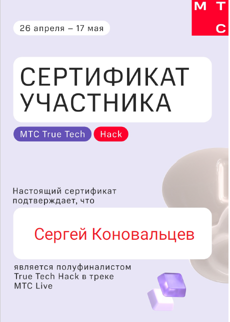
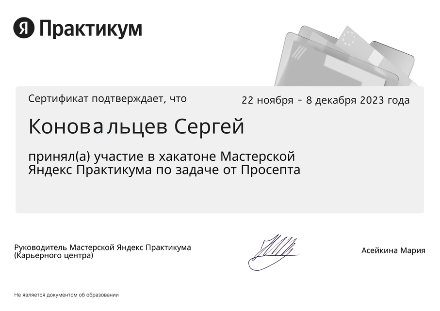
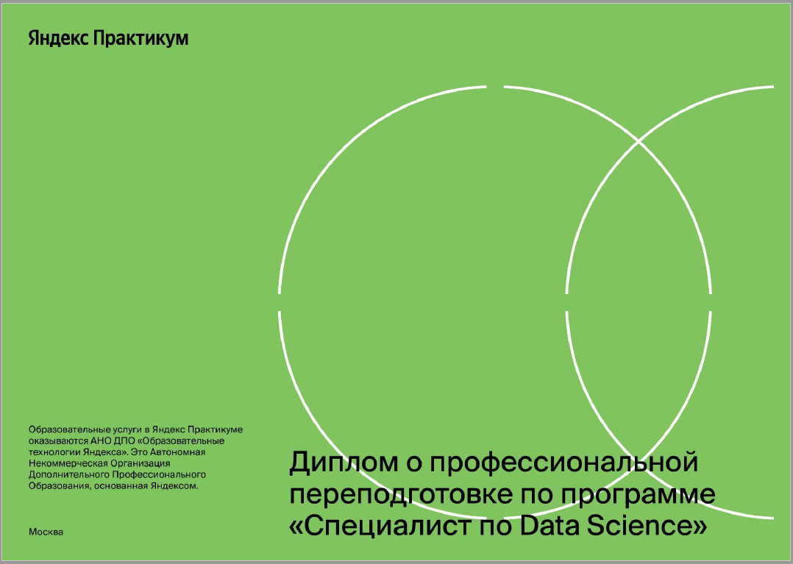
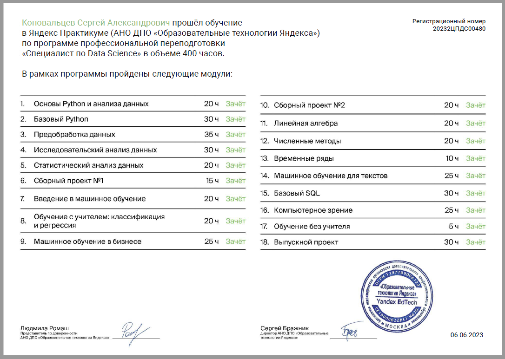
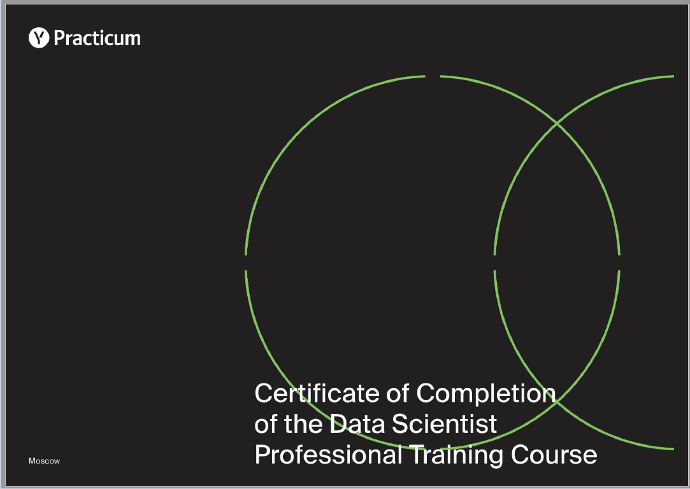
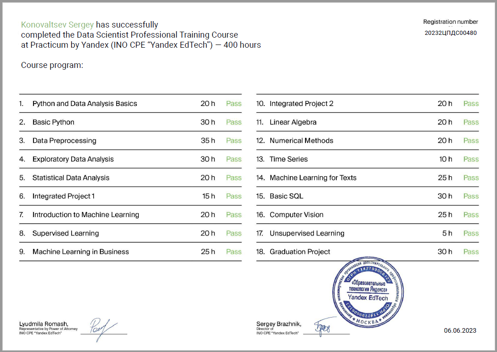

<!-- main -->

# 👋 Приветствую! Я Сергей!

**Data Scientist / Data Analyst**

---

### Текущая деятельность
В настоящее время сосредоточен на аналитике данных и машинном обучении, применяя различные алгоритмы для извлечения ценной информации из данных.

### Основные навыки
- **Языки программирования**: Python
- **Библиотеки**: `Pandas`, `NumPy`, `scikit-learn`, `CatBoost`, `pandas_profiling`, `TensorFlow`, `Keras`.
- **Инструменты**: SQL, Power BI
- Обладаю опытом работы с NLP, временными рядами и другими инструментами.

### Опыт работы
- **Фриланс**
- Ранее работал бизнес-аналитиком, занимаясь разработкой баз данных и внедрением CRM систем.
- Выпускник Яндекс Практикума по специальности Data Science.

---

### [Real-life Challenges](https://github.com/TrollenGoblinson/Real-life_Challenges)

---

 
    
    
    

    
---

[Здесь представлены проекты выполненные в рамках обучения Яндекс Практикум по специальности Data Science.](https://github.com/TrollenGoblinson/yandex_practicum.git)

---

 

 
  
---

<h3><b>Свяжитесь со мной</b></h3>

<!--
**TrollenGoblinson/TrollenGoblinson** is a ✨ _special_ ✨ repository because its `README.md` (this file) appears on your GitHub profile.

Here are some ideas to get you started:

- 🔭 I’m currently working on ...
- 🌱 I’m currently learning ...
- 👯 I’m looking to collaborate on ...
- 🤔 I’m looking for help with ...
- 💬 Ask me about ...
- 📫 How to reach me: ...
- 😄 Pronouns: ...
- ⚡ Fun fact: ...
-->
